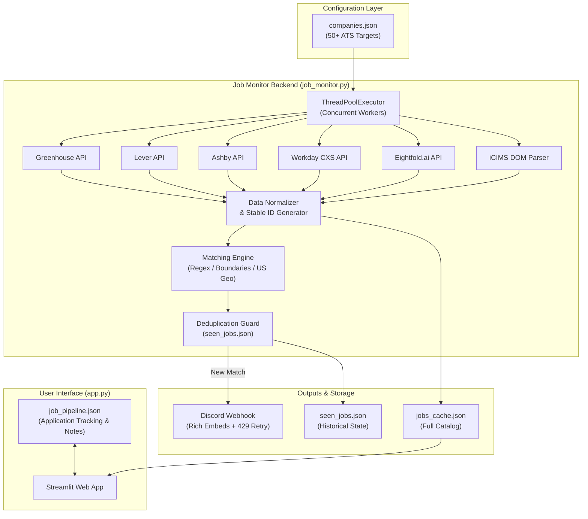

# 🔎 Jobby Finda

> **A high-performance, direct-from-source job aggregation and tracking engine that interfaces directly with company career portals (ATS APIs) to bypass aggregator delays and ghost postings.**

[](https://www.python.org/)
[](https://streamlit.io/)
[](https://github.com/features/actions)
[](https://discord.com/)
[](https://opensource.org/licenses/MIT)

---

## 📌 Table of Contents

- [Motivation & Problem](#-motivation--problem)
- [Key Features](#-key-features)
- [System Architecture](#-system-architecture)
- [Supported ATS Platforms](#-supported-ats-platforms)
- [Tech Stack](#-tech-stack)
- [Project Structure](#-project-structure)
- [Quick Start (Local Development)](#-quick-start-local-development)
- [CLI State Management & Utilities](#-cli-state-management--utilities)
- [Adding New Companies](#-adding-new-companies)
- [Deployment & Automation](#-deployment--automation)
- [Roadmap](#-roadmap)
- [Author](#-author)

---

## 💡 Motivation & Problem

Traditional job aggregator platforms (LinkedIn, Indeed, ZipRecruiter) introduce significant frictions for job seekers:
- **Ghost Listings & Stale Data:** Openings often remain listed weeks after they've been filled or closed.
- **Aggregation Latency:** Third-party aggregators index roles hours or days after they go live on official company career portals.
- **Anti-Scraping Defenses & Paywalls:** Aggregators obfuscate source URLs, inject sponsored spam, and block automated scrapers.

**Jobby Finda solves this at the root:** It queries the **Applicant Tracking System (ATS) APIs** used by companies directly. By interfacing with Greenhouse, Lever, Ashby, Workday, Eightfold, and iCIMS endpoints, it retrieves **100% active, verified roles the moment they are posted**.

---

## ✨ Key Features

- **Direct ATS Integration:** Connects directly to public career board APIs across 50+ enterprise and startup tech companies without relying on fragile web scraping.
- **Concurrent Scraping Pipeline:** Uses Python's `ThreadPoolExecutor` to query dozens of company endpoints concurrently, reducing total scrape time by over 70%.
- **Heuristic Seniority Classifier:** Categorizes incoming listings into 4 distinct experience tiers using pre-compiled regex tokenization:
  - 🎓 **Internships / Co-ops** (`intern`, `co-op`, `student`, `fellow`)
  - 🌱 **New Grads & Early Career** (`entry-level`, `associate`, `swe 1`, `junior`, `level 1`)
  - 💼 **Experienced** (mid-level software engineering roles)
  - 🚀 **Seniors & Leads** (`senior`, `staff`, `principal`, `lead`, `architect`)
- **Geographic & Keyword Filtering:** Normalizes locations across all 50 US states, major tech hubs, and remote positions while filtering out non-US regions.
- **Real-Time Discord Alerts:** Sends rich embeds to Discord channels the moment a role matching your target criteria appears, complete with automatic HTTP 429 rate-limit backoff.
- **Interactive Streamlit Web Dashboard:** A fast, responsive UI featuring real-time multi-criteria filtering, role badges, and dark-mode styling.
- **Built-in Application Kanban Tracker:** Track your personal application funnel directly in the UI (`New` ➔ `Saved` ➔ `Applied` ➔ `Interview` ➔ `Rejected`) with per-job notes persisted locally in `job_pipeline.json`.
- **Zero-Cost Serverless Automation:** Leverages GitHub Actions on a 4-hour cron schedule with a "Git-as-a-database" architecture to persist state and cache without external database hosting fees.

---

## 🏗️ System Architecture



---

## 🔌 Supported ATS Platforms

| ATS Provider | Ingestion Method | Protocol / Format | Features Supported |
| :--- | :--- | :--- | :--- |
| **Greenhouse** | Official Public Board API | REST / JSON | Full listing, location, job URLs |
| **Lever** | Official Postings API | REST / JSON | Hosted URLs, category tags |
| **Ashby** | Job Board API | REST / JSON | Structured addresses, postal fallback |
| **Workday** | Internal CXS Single-Page API | HTTP POST / JSON | Custom tenant routing, pagination |
| **Eightfold.ai** | Career Apply v2 API | REST / JSON | Search queries, domain filtering |
| **iCIMS** | Iframe Portal Search | SSR HTML / Regex | Tag stripping, ID regex extraction |

---

## 🛠️ Tech Stack

- **Language:** Python 3.10+
- **Frontend / Web UI:** [Streamlit](https://streamlit.io/) with custom CSS injection
- **Networking & Ingestion:** `requests`, `urllib.parse`
- **Concurrency:** `concurrent.futures.ThreadPoolExecutor`
- **Pattern Matching & NLP:** Pre-compiled Regular Expressions (`re`) with lookaround word boundaries
- **Notifications:** Discord Webhooks (REST API)
- **CI/CD & Automation:** GitHub Actions (`schedule` cron + `workflow_dispatch`)
- **Storage / State:** JSON Flat Files (`jobs_cache.json`, `seen_jobs.json`, `job_pipeline.json`)

---

## 📂 Project Structure

```text
job-tracker/
├── .github/
│   └── workflows/
│       └── job_check.yml         # GitHub Actions cron workflow (every 4 hours)
├── .streamlit/
│   └── config.toml               # Streamlit theme & UI configurations
├── app.py                        # Streamlit web app & application pipeline tracker
├── job_monitor.py                # Core scraping, filtering, and alerting engine
├── companies.json                # Registry of target companies and ATS settings
├── jobs_cache.json               # Aggregated cache of active job listings
├── seen_jobs.json                # Historical record of alerted job IDs (production)
├── seen_jobs.local.json          # Local development history file
├── requirements.txt              # Production dependencies
└── README.md                     # Project documentation
```

---

## 🚀 Quick Start (Local Development)

### 1. Prerequisites
Ensure you have **Python 3.10+** and `pip` installed:
```bash
python --version
```

### 2. Clone & Install Dependencies
```bash
git clone https://github.com/YOUR_USERNAME/job-tracker.git
cd job-tracker
pip install -r requirements.txt
```

### 3. Launch the Search & Pipeline Web App
```bash
streamlit run app.py
```
Open [http://localhost:8501](http://localhost:8501) in your browser.

### 4. Run the Job Monitor Locally (Optional)
To fetch live jobs, update the cache, and test Discord alerts:
```bash
# Set your Discord webhook (optional, skips alert sending if omitted)
export DISCORD_WEBHOOK_URL="https://discord.com/api/webhooks/..."

# On Windows PowerShell:
# $env:DISCORD_WEBHOOK_URL="https://discord.com/api/webhooks/..."

python job_monitor.py
```

---

## ⚙️ CLI State Management & Utilities

`job_monitor.py` includes a robust CLI interface for maintaining history and preventing bloated state files:

```bash
# Run monitor normally
python job_monitor.py

# Prune entries older than 30 days (automatically creates a .bak safety backup)
python job_monitor.py --prune 30

# Completely reset seen jobs history (creates a backup first)
python job_monitor.py --clear

# Specify a custom history file
python job_monitor.py --prune 14 --file seen_jobs.local.json

# Skip creating a backup file when clearing
python job_monitor.py --clear --no-backup
```

---

## 🏢 Adding New Companies

New companies can be added dynamically in [`companies.json`](./companies.json) without modifying Python code.

### Greenhouse
```json
"stripe": {
  "type": "greenhouse",
  "slug": "stripe",
  "display_name": "Stripe"
}
```

### Lever
```json
"spotify": {
  "type": "lever",
  "slug": "spotify",
  "display_name": "Spotify"
}
```

### Ashby
```json
"ramp": {
  "type": "ashby",
  "slug": "ramp",
  "display_name": "Ramp"
}
```

### Workday
```json
"nvidia": {
  "type": "workday",
  "domain": "nvidia.wd5.myworkdayjobs.com",
  "tenant": "nvidia",
  "career_site": "NVIDIAExternalCareerSite",
  "display_name": "NVIDIA"
}
```

### Eightfold.ai
```json
"northropgrumman": {
  "type": "eightfold",
  "domain": "ngc.com",
  "subdomain": "ngc",
  "base_url": "https://jobs.northropgrumman.com",
  "display_name": "Northrop Grumman"
}
```

---

## 🌐 Deployment & Automation

### Automated Monitoring via GitHub Actions
The background scraper and notification bot runs on GitHub Actions ([`.github/workflows/job_check.yml`](./.github/workflows/job_check.yml)):
1. Navigate to **Repository Settings** ➔ **Secrets and variables** ➔ **Actions**.
2. Add a repository secret named `DISCORD_WEBHOOK_URL`.
3. The workflow executes automatically every 4 hours (`0 */4 * * *`), pulls fresh jobs, fires Discord notifications, and commits the updated `jobs_cache.json` and `seen_jobs.json` back to the repository.

### Deploy Web Dashboard to Streamlit Community Cloud
1. Push your repository to GitHub.
2. Sign in to [Streamlit Community Cloud](https://share.streamlit.io/).
3. Select this repository and set the main file path to `app.py`.
4. Deploy! The hosted dashboard will continuously read the updated `jobs_cache.json` committed by GitHub Actions.

---

## 🗺️ Roadmap

- [x] Multi-ATS API reverse engineering (Greenhouse, Lever, Ashby, Workday, Eightfold, iCIMS)
- [x] Concurrent multithreaded fetching
- [x] Experience tier heuristics (Intern, New Grad, Experienced, Senior)
- [x] Discord notification dispatcher with HTTP 429 backoff
- [x] Streamlit web application & local Kanban pipeline tracking
- [ ] Multi-user database integration (PostgreSQL / Supabase)
- [ ] Email & SMS alert integrations (SendGrid / Twilio)
- [ ] AI-powered resume matching (Gemini API for fit scoring)

---

## 👨‍💻 Author

**Josh**  
- **GitHub:** [@josh-dev](https://github.com) *(Update with your GitHub handle)*  
- **LinkedIn:** [Connect on LinkedIn](https://linkedin.com) *(Update with your LinkedIn URL)*  

*If you found this project helpful, please consider giving it a ⭐ on GitHub!*
